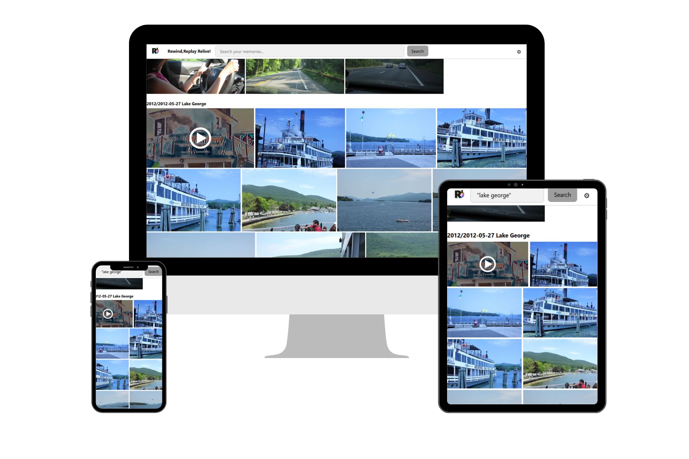

# Rewind-Replay: Relive your (captured) moments!

Rewind-Replay is (planned to be) a no frills, self-hosted photos app that helps in organizing and more importantly searching your photos.

Currently this project is very much a work-in-progress.

# Philosophy

1. We don't want to use cloud providers for personal photo collection.
2. Some of us really care about our media in folders that we have meticulously curated from a long time. With any tool, we want the ability to continue to manage pics in folders.
3. The single source of truth is the photo itself. (For those who don't know, a photo/video taken by a modern camera/phone not only stores the image/video content, but also some/a lot of metadata about the content). Hence, we want all metadata, including user tags, ML based face / objects labels etc., to go back to the photo, to the extent possible.
4. In the same vein, we also want the tool to utlize the metadata already existing in the photos (updated by device / other tools).
5. In other words, we don't want to be locked-down by any one particular tool (including this one!).
6. Some kind of sensible, not too constrained search is needed, even though it may (will) not be as good as Google.


# Key Terms
1. **Photo / Video**: The individual photo / video (duh!)
2. **Album**: A group of related photos (and videos). For e.g. "2021-10-01 Trip to SVBF"
3. **Collection**: A set of related albums. For e.g. "My family pics", "My small-business pics" etc.
4. **Indexing**: The process of reading media and cataloging metadata to help with search. Also thumbnail generation.


# Current Features
- Index media photos, videos and audio
- Display photos and videos on a responsive, progressive, scrollable grid
- Search photos based on their metadata



# Features TODO
**Near future**
- Slideshow
- Mark as favorite / stars
- Add/change "tags" (keywords)
- Optional staging area
- Ability to move / delete files
- Ability to rename files (mainly videos) similar to folders

**After near future**
- An acutal form to setup collections
- Ability to upload photos from device
- Intelligent scrollbar (folder levels?)
- Status bar for Indexer
- Face recognition
- Object detection (computer vision)
- Clustering photos on map
- PWA

# How to install

- **Install necessary software**
  - [Node](https://nodejs.org/en/) (to run the server)
  - [SQLite3](https://www.sqlite.org/download.html) (for better-sqlite3)
  - [ffmpeg](https://ffmpeg.org/download.html) (for fluent-ffmpeg)
  - (for future) g++ (for tensorflow.js)
  - On Linux, simply run 
    - `sudo apt install node sqlite3 g++ ffmpeg`

- **Install code (just clone this repo)**
  - `$ git clone https://github.com/mrbrahman/rewind-replay.git`

- **Install dependencies**
  ```bash
  $ cd rewind-replay
  $ npm install
  ```

- **Start server**
  ```bash
  $ node server.mjs`
  ```

- **Setup Collection**

  Until the UI is available to create collections, use backend. For e.g.

  ```bash
  $ cat c.json
  {
    "collection_name":"Test",
    "collection_path":"/home/mrbrahman/Projects/test-collection/",
    "album_type":"FOLDER_ALBUM",
    "listen_paths":["/home/mrbrahman/Projects/test-collection-new-files/"],
    "apply_folder_pattern":"yyyy/yyyy-mm-dd",
    "default_collection":1
  }
  
  $ curl -X POST -H 'Content-Type: application/json' -d @c.json "http://localhost:9000/createNewCollection"
  ```
- Wait for indexing to complete
- Enjoy!

# Architecture
## Main
- nodejs server
- SQLite 3 database

## Supporting
- Sqlite3 provided FTS5 for searches
- sharp for image operations
- fluent-ffmpeg for video operations
- exiftool-vendored for metadata read / write
- Use browser native features (HTML5) to play videos

